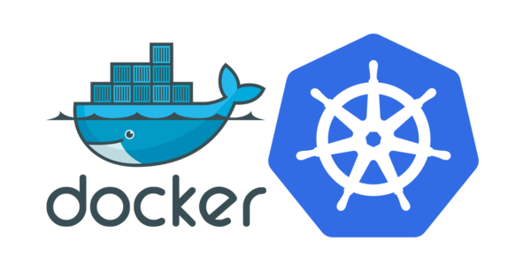

# learn-docker-k8s

🐳 Let's learn about docker and kubernetes from beginner's knowledge up-to production grade setups.

## Chapters 📚

1. [The Basics](1-basics-of-docker)
2. [Dockerfile](2-docker-file-img)
3. [Node Web App - Basic](3-node-web-app)
4. [Node Web App 2 - Docker Compose](4-docker-compose)
